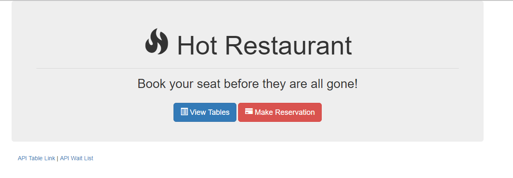

# HotRestaurant

* Description: Basic app demonstrating Node and Express with vanilla javascript. Overall purpose is to help schedule reservation requests. Restaurant has just 5 tables available. First five requests get a reservation, every request after that is sent to the waiting list.
* Live Demo: <https://hot-restaurant-fsf.herokuapp.com/>

